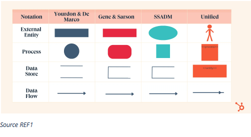
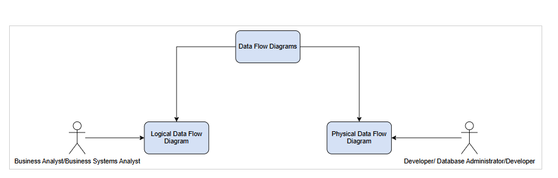
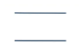
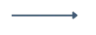

 **OVERVIEW** 

When an integrations team needs a standardized way of documenting system data flows and process flows to make design decisions and come up with an Architecture.  

The most effective way the Data Flow Diagram model (DFD).  

This document aims to define the DFD Methodology (there are four).

 **WHAT IS A DATA FLOW DIAGRAM (DFD)?** 

A data flow diagram is a visual representation of processes and functions in a system.  

These capture, store, manipulate and distribute data between a system and its environment.  

Likewise, they show how that goes with data between system components.

 **DATA FLOW METHODOLOGIES** 

There are four data flow methodologies (REF1) as shown in the diagram below, namely Yourdon & De Marco, Gene & Sarson, SSADM, and Unified, each of which has slight variations of symbols.  

It is important to identify which methodology has been used when reading DFDs to not mistake the symbols from each.

 **SELECTED DIAGRAM METHODOLOGY** 

As a team, it was decided to select a single DFD methodology going forward for diagrams to avoid confusion and keep a consistent standard.  

Diagram selection was first looked at from popularity and then the one which is supported by the diagramming tool used namely [http://Draw.io](http://Draw.io) .  

Using these criteria, Yourdon & De Marco was chosen.  

It is important to note that when reading a DFD from any other sources it would be important as a first step to identify which diagramming methodology was used, to not confuse.

 **DATA FLOW DIAGRAM TYPES** 

There are two types of Data Flow Diagrams. These are normally drawn by different roles in the organization and show different points of view i.e. perspectives. (REF4)

 **LOGICAL** 

* View from a Business Perspective  

* What will happen  

* Business Operation and Goals  

* BA/SA Creates

 **PHYSICAL** 

* System Perspective  

* How data will happen  

* System Implementation  

* Dev/DBA Creates

Here’s the full transcription from your image, presented in plain text with clear headings and spacing for easy copying into any document:

 **ELEMENTS AND SYMBOLS OF DATA FLOW DIAGRAM USING YOURDON & DE MARCO METHODOLOGY** 

 **ENTITY** 

* Used for external actors, sources or sinks, and terminators.  

* Data must not flow between two Entities.  

* Produces and consumes the data flowing between the entity and the process.  

* Used as the sources and destinations of the data.

 **PROCESS** 

* Shows the process that's occurring or the task being performed on the data.  

* It is an activity that transforms or modifies the data flow.  

* The name should be made up of a Verb and a Noun (e.g., Get Employee Data).  

* Inputs come in from the left and main outputs exit on the right.  

* Secondary flows come out from the bottom of the object.  

* Data from sources coming into the process come in from the top of the object.  

* Must have at least one input and one output.  

* Cannot have more outputs than the sum of inputs.  

* The number of Processes on a DFD should not exceed twelve.  

* All Processes must be linked to another Process or a Data Store.

 **DATA STORE** 

* This could be the system’s database, web API that is used to retrieve data, etc.  

* Data must not flow between Data Stores.  

* Its function is not to generate any operations but to hold data for later use.  

* Must have a minimum of one data flow in or out.  

* Should flow in and out of Processes.  

* Must have an input and output Data Flow.

 **DATA FLOW** 

* Shows movements between entities, data stores, and processes.  

* They have a label indicating the type of data being exchanged.  

* If the data flow goes into a data store with the same name then the flow doesn’t need a name.  

* Must have a name except for the condition above.  

* Do not group unrelated data into one data flow if they are not treated as one unit of data.

 **FLOW RULES BETWEEN COMPONENTS** 

Entity to Process Rules  

* Data must flow from Entity to Process or vice versa.  

* The number of multiple data flows from one Entity to a Process.

Data Store to Entity  

* Data cannot flow from an Entity to a Data Store.  

* Data must be transformed by a process before going to the Data Store and vice versa.

Process to Data Store Rules  

* Data must flow from Process to Data Store or vice versa.  

* A Data Store must have both an input and output data flow.  

* Data can flow from the Data Store to multiple Processes.  

* The number of Processes on a DFD should not exceed twelve.

 **DATA FLOW DIAGRAM LEVELS** 

 **CONTEXT LEVEL** 

21002950426226621DataFlowExample.drawio11https://orignals.atlassian.net/wikiDataFlowExample.drawio0581121
* Only one Process shows the entire system.  

* Shows how Entities interact with the system.  

* Doesn't show Data Stores.  

* Flow lines are used to show data from External Entity to Process.  

* Flow lines also show information flowing from a Process to an External Entity.

 **LEVEL 0** 

* The Processes only have numbers i.e. 1.0, 2.0, 3.0.  

* Can have many Processes.  

* The output of one Process can flow into another Process.  

* Shows Data Stores i.e. Database.

 **LEVEL 1** 

* Only shows sub-Processes.  

* Processes are exploded and identified using their Level 0 designation with a minor version i.e. 1.1, 1.2, 1.3.  

* The output of one Process can flow into another Process.  

* Shows Data Stores i.e. Database.  

* External Entities are optional.

 **LEVEL 2 - N (WHERE N < MAX 7)** 

* Used to show more detail around a Process.  

* Sub Processes from Level are broken down even further i.e. 1.11, 1.12, 1.13.  

* Use this level to break up Processes into smaller components.

 **RULES WHEN MOVING BETWEEN DFD LEVEL 0 (CONTEXT DIAGRAM) TO LEVEL 1** 

* The one big Process needs to be decomposed into individual sub-Processes.  

* Each Sub Process needs to be numbered using whole numbers.  

* Data Stores for each Sub Process need to be shown.

 **RULES WHEN MOVING BETWEEN DFD LEVEL 1 TO LEVEL 2** 

* Pick one Sub Process and break it up into further Sub Processes (Only one—if another needs to be broken up it would need a separate diagram).  

* Each Sub Process needs to have its original major number and a minor number.

 **REFERENCES** 

(1) Guide on Data Flow Diagrams – [https://blog.hubspot.com/marketing/data-flow-diagram](https://blog.hubspot.com/marketing/data-flow-diagram)

(2) Data Flow Diagram Tutorial  

(3) Data Flow Diagrams, Introduction to Data Flow Diagrams, Level 1 Data Flow Diagram (DFD), Level 2 Data Flow Diagram (DFD)  

(4) Data Flow Diagrams by The Business Analysis Doctor – Data Flow Diagrams

*****

[[category.storage-team]] 
[[category.confluence]] 
