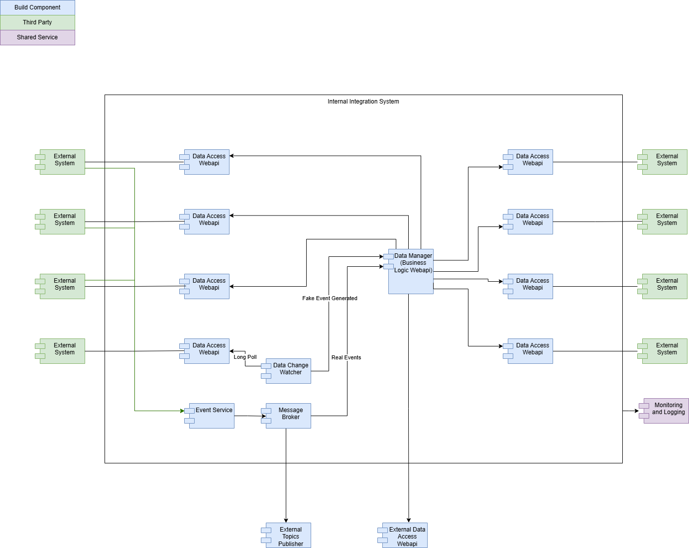

## Architectural Patterns Used in Design
The system uses a combination of well-established patterns designed for scalability, decoupling, and extensibility. Here's a breakdown of the architectural patterns in use:

### 1.  **Microservices Architecture** 
Each component—such as  _Data Access WebAPI_ ,  _Data Manager_ ,  _Data Watchdog_ , and  _Event Service_ —is encapsulated with specific responsibilities. These are likely deployed independently and interact via lightweight protocols, suggesting a  **microservices**  approach. This allows updates, scaling, and deployment per service, without impacting others.

### 2.  **Event-Driven Architecture** 
The presence of a  **Message Broker**  and services reacting to  **Real Events**  and  **Fake Events**  indicates strong use of event-driven principles. Components like the  _Event Service_  subscribe to or publish messages asynchronously, improving responsiveness and decoupling.

### 3.  **Publisher-Subscriber Pattern** 
 _External Topics Publisher_  and internal components likely leverage a  **Pub-Sub mechanism**  through the Message Broker. This enables multiple consumers (internal services or external systems) to independently respond to the same event stream.

### 4.  **Service-Oriented Architecture (SOA)** 
While the system follows microservices, the  _Data Manager_  and  _External Data Access WebAPI_  show characteristics of  **SOA** , where services expose interfaces for use by both internal and external consumers, potentially governed by contracts.

### 5.  **API Gateway / Backend-for-Frontend (BFF)** 
The  _Data Access WebAPI_  components appear to function as  **gateways**  to backend services, acting as a control point between external consumers and the internal integration layer. This centralizes access control, logging, and throttling.

### 6.  **Orchestration Pattern** 
In this role, the  **Data Manager**  becomes the central coordinator. It manages:

*  **Input acquisition**  (pulling or receiving from Data Access Layers or APIs),

*  **Transformation or validation**  (applying business logic),

*  **Output delegation**  (distributing results to Event Services, databases, or other consumers).

This fits the  **Orchestration**  pattern versus  **Choreography** , where each component would independently react to events. In orchestration, one component (your Data Manager) drives the entire interaction.

*****

[[category.storage-team]] 
[[category.confluence]] 
