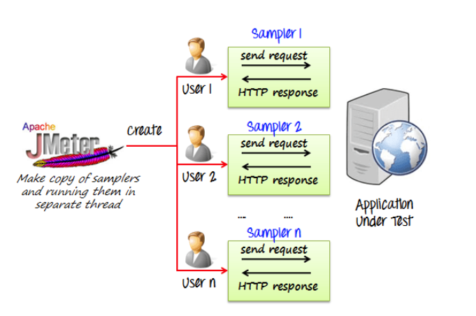

 **INTEGRATIONS SOAK TESTING V1.0**  **WHAT IS SOAK TESTING?** Soak Testing is a type of non-functional testing that is used to measure the performance of a software application under a huge volume of load for an extended period of time.

The goal of Soak testing is to ensure whether the software application sustains a high volume of usage and to check what would happen outside its design expectations.

In this type of testing, what is monitored is the memory utilization by an application in a system. It is testing at a system level to determine whether the system will withstand a very high volume of usage and to see what would happen outside its design expectations.

 **WHY DO SOAK TESTING?** A system may behave normally when used for 2 hours, but when the same system is used continuously for 10 hours or more, it may fail or behave abnormally/randomly, or it may crash. To predict such failures, Soak Testing is performed.

 **SETUP AND USAGE** [[JMeter setup and usage.|Performance-Testing-JMeter]]

 **INTEGRATIONS STRESS TESTING V1.0**  **WHAT IS LOAD TESTING?** Load testing determines whether the web application under test can satisfy high load requirements or not.

It also helps to analyze overall server behavior under heavy load.

 **WHY DO LOAD TESTING?** Every web application has a maximum load capacity. If the load exceeds the web application's capacity, it may slow down, produce errors, or become unusable.

The primary purpose of load testing is to check how much load a system can handle, ensuring it meets user demands.

Load testing is also used to:

* Identify the maximum operating capacity of an application.

* Determine if existing infrastructure is sufficient for expected load.

* Define the number of users that can work on an application concurrently.

 **SETUP AND USAGE** 

JMeter setup and usage.

 **HOW JMETER LOAD TESTING SIMULATES HEAVY LOAD?** 

JMeter simulates heavy load by:

* Making copies of samplers and running them in separate threads.

* Simulating multiple users sending requests and receiving HTTP responses through samplers.

* Evaluating application performance under increasing load conditions.

*****

[[category.storage-team]] 
[[category.confluence]] 
