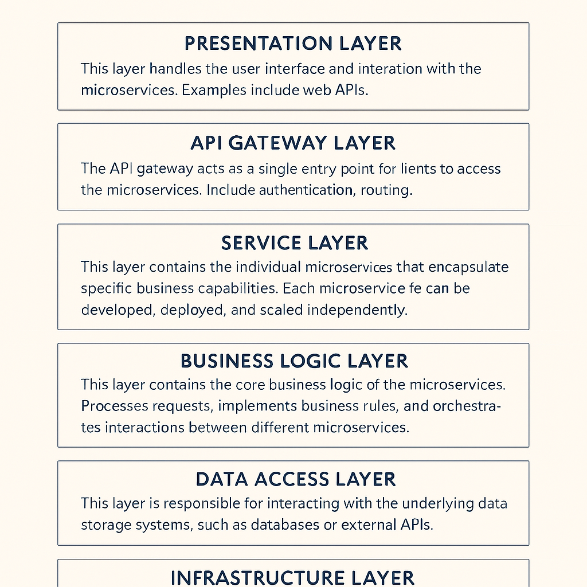

 **INTEGRATIONS TYPICAL LAYERS FOR MICROSERVICE ARCHITECTURE** 

 **PRESENTATION LAYER** 

* This layer handles the user interface and interaction with the microservices.  

* It can include components like web APIs, user interfaces, and mobile applications.

 **API GATEWAY LAYER** 

* The API gateway acts as a single entry point for clients to access the microservices.  

* It handles authentication, routing, load balancing, and other cross-cutting concerns.

 **SERVICE LAYER** 

* This layer contains the individual microservices that encapsulate specific business capabilities.  

* Each microservice is responsible for a specific task or functionality.  

* Microservices can be developed, deployed, and scaled independently.

 **BUSINESS LOGIC LAYER** 

* This layer contains the core business logic of the microservices.  

* It processes requests, implements business rules, and orchestrates interactions between different microservices.

 **DATA ACCESS LAYER** 

* This layer is responsible for interacting with the underlying data storage systems, such as databases or external APIs.  

* It handles data retrieval, storage, and manipulation.

 **INFRASTRUCTURE LAYER** 

* This layer includes the infrastructure required to run microservices.  

* Examples include servers, containers, networking, and monitoring tools.

*****

[[category.storage-team]] 
[[category.confluence]] 
