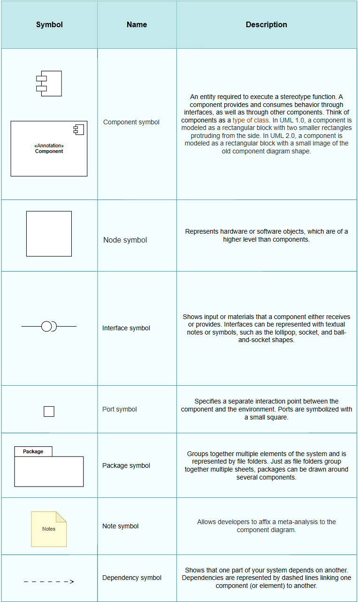
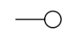
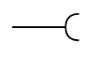
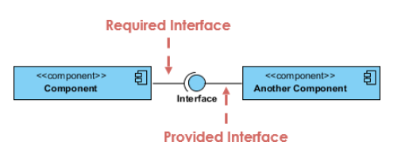
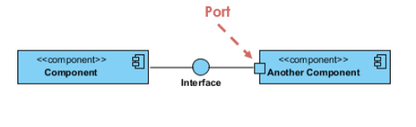
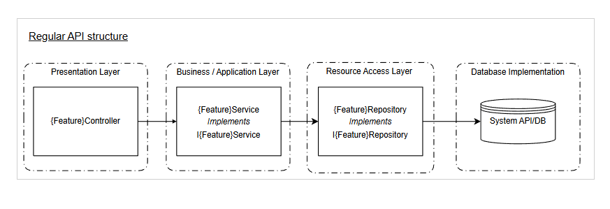

 **WHAT IS A UML COMPONENT DIAGRAM?** 

UML Component diagrams are used in modeling the physical aspects of object-oriented systems that are used for visualizing, specifying, and documenting component-based systems and also for constructing executable systems through forward and reverse engineering.  

Component diagrams are essentially class diagrams that focus on a system’s components that are often used to model the static implementation view of a system.

 **Component Diagram Shapes and Symbols** 

 Please note diagrams range from simple and high level to detailed and complex. Either way you’ll want to familiarize yourself with the appropriate UML Symbols.

The following are the shape types that you will commonly encounter when reading and building component diagrams:

## 🧩 UML Component Diagram Reference – Editable Template

### 📘 How to Use Component Shapes and Symbols
There are a few popular ways to define a component's name compartment. You must always include the keyword <<component>> and/or the component symbol. This is important because a simple rectangle with just a name is reserved for classifiers (i.e., class elements).

Just like class notation, components may optionally list interfaces, similar to class methods and attributes. Interfaces represent the external communication points of the component with other parts of the system.

Alternatively, interfaces can also be shown visually by extending symbols from the component box. Here are the most frequently used symbols:

*  **Provided Interfaces (Lollipop)** :  

    A straight line from the component box with an attached open circle. This denotes an interface the component offers to others.

*  **Required Interfaces (Socket)** :  

* 

A straight line with a half-circle attached. It indicates the component needs an interface in order to function correctly.

### 🔳 Port
Ports are shown as small squares along the edge of the system or a component. They help expose required and provided interfaces from a component.

### 🏗️ Building a Component Diagram
In UML, a component diagram visually illustrates how software system parts relate to one another. A component diagram should communicate:

* The scope of your system  

* The structure of your system  

* The goals your system helps users (human or non-human actors) achieve  

### ⚙️ Overall Structure for an API Project
This diagram illustrates the general structure of a typical WebAPI project. Actual implementations may vary depending on specific architecture or requirements.

### 🧪 Example Component Diagram
2010753824983343UML Component Example.drawio122https://orignals.atlassian.net/wikiUML Component Example.drawio01425.99999999999981461Use this template as a starting point to create your own system design.

### 📚 References

* UML 2 Component Diagrams: An Agile Introduction ([http://agilemodeling.com](http://agilemodeling.com) )  

* “Naming Classes - How to avoid calling everything a SomethingManager?” – Stack Overflow  

* “What is Component Diagram?” – [http://visual-paradigm.com](http://visual-paradigm.com)

*****

[[category.storage-team]] 
[[category.confluence]] 
