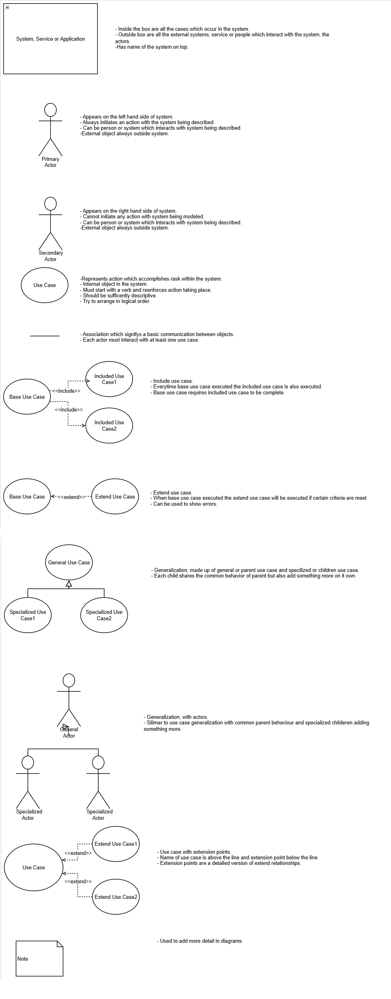

A use case diagram is a basic diagram of what a system does at a very high level and doesn't show a high level of detail.

The diagram should be restricted to just a simplistic visualization

It shows the following items:

* System or application (square box)

* People, organizations, or other systems that interact with it (stick man)

* What the system or application does (oval shape)

* Basic flows of what the system does (lines between objects)

*****

[[category.storage-team]] 
[[category.confluence]] 
